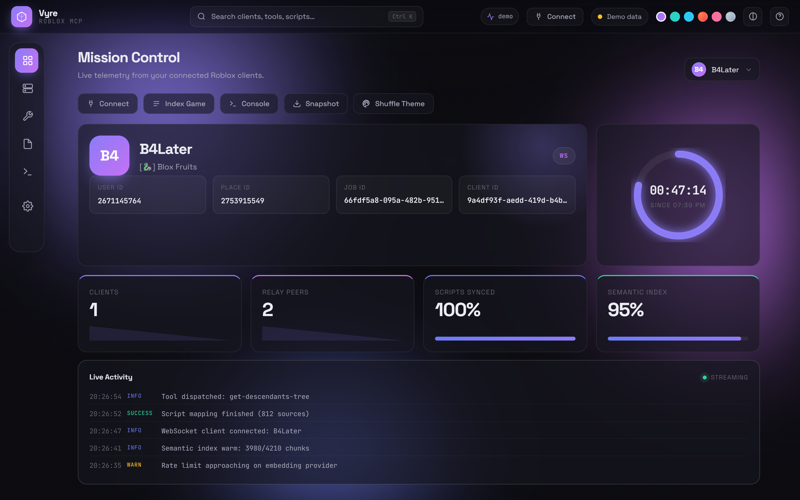
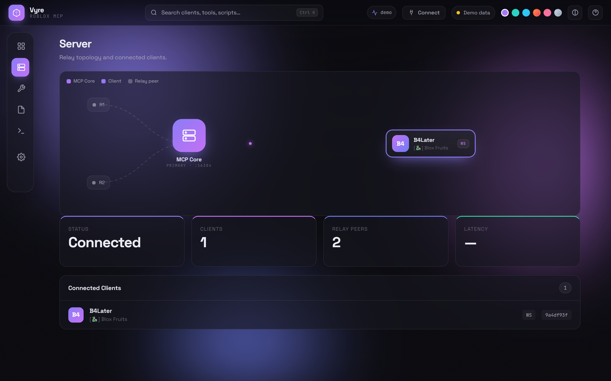
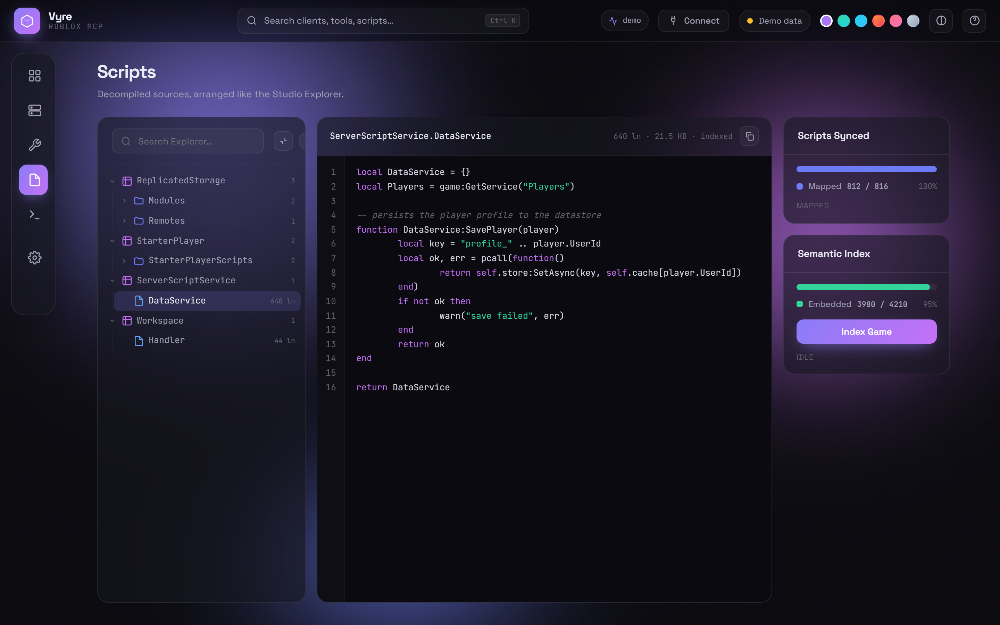
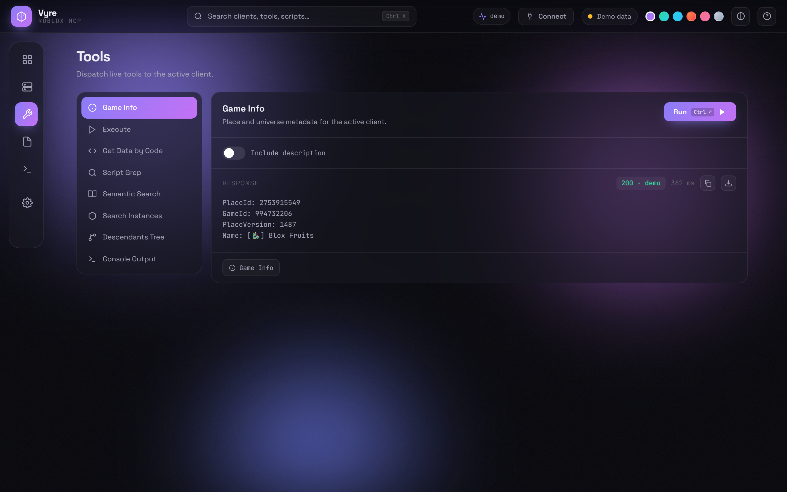
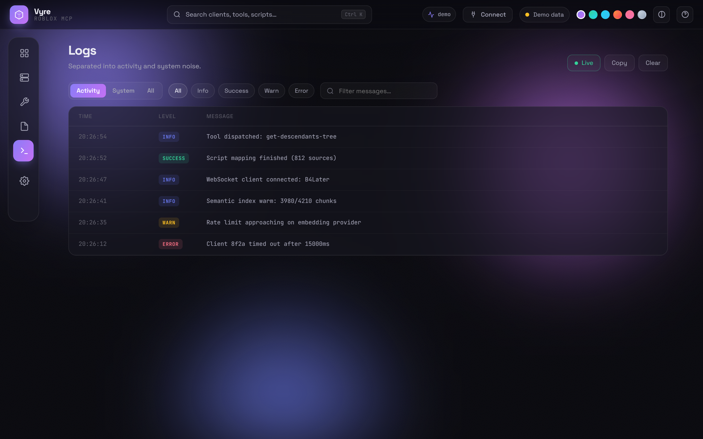
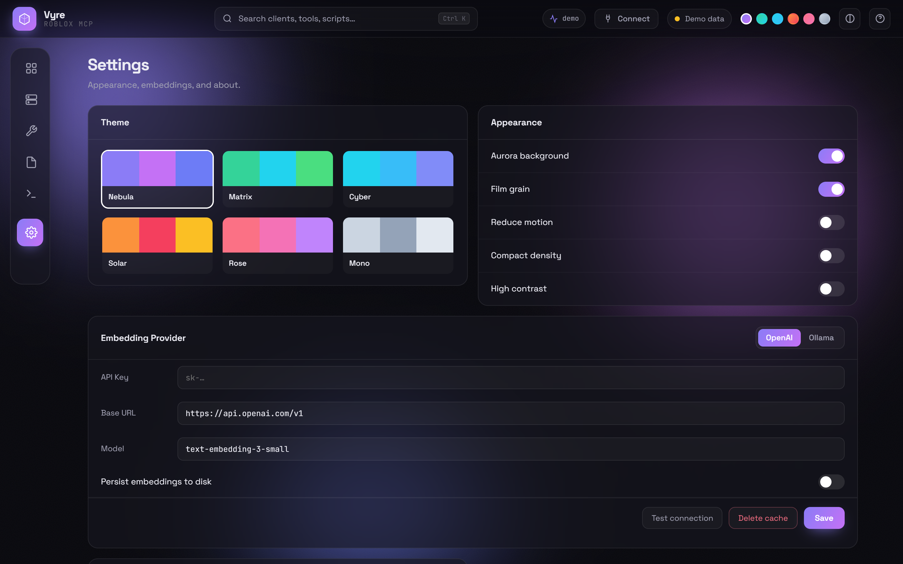
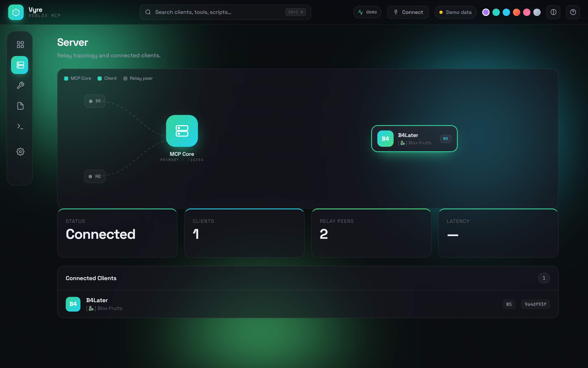
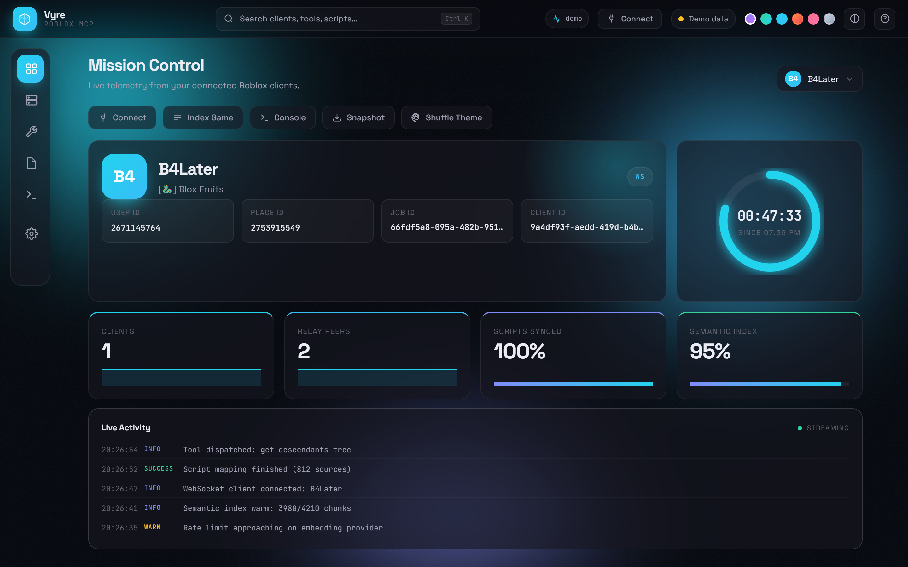

# Vyre — Roblox MCP Dashboard

> **Want the whole thing (server + dashboard) ready to install?** Use the full repo: **[dedankschool-oss/roblox-executor-mcp](https://github.com/dedankschool-oss/roblox-executor-mcp)** — clone, `npm run install:harnesses`, done. This repo is just the standalone dashboard front-end.


A drop-in control panel for the Roblox MCP bridge. Same backend, same API, a completely reworked face: a floating glass **dock**, a **bento** mission-control overview, a **Studio-style script Explorer**, a live **relay topology**, six switchable **color themes**, a grouped **⌘K command palette**, and a **demo mode** so it looks alive even with no client connected.

Three files. No build step. No dependencies.

```
index.html   ·   dashboard.css   ·   dashboard.js
```

The files are already named to match what the bridge serves — copy them straight in, no renaming.

---

## Highlights

- **New layout** — a hover-expand icon **dock** instead of a static sidebar, a **command bar** with global search, live latency, a Connect button, palette dots, and contrast/help toggles.
- **Bento overview** — hero client card, animated uptime ring, live stat tiles with sparklines, a quick-action bar, and a live activity ticker.
- **Studio-style Scripts Explorer** — decompiled sources arranged as a collapsible tree (services → folders → scripts, with class icons), a syntax-highlighted source viewer with line numbers, and the classic **Scripts Synced / Semantic Index** progress panels.
- **Live relay topology** — an animated MCP-core graph with orbiting client and relay nodes, flowing packets, and clickable clients.
- **Grouped logs** — split into **Activity** vs **System** so startup chatter stops drowning real events, with level chips, search, and repeat-collapsing (`×N`).
- **Full embedding settings** — OpenAI / Ollama provider switch, key / base-URL / model fields, persist-to-disk toggle, **Save**, **Test connection**, and **Delete cache** — wired to the real endpoints.
- **Six themes** — Nebula, Matrix, Cyber, Solar, Rose, Mono — switchable from palette dots or Settings, saved to `localStorage`.

---

## Feature list

**Layout & shell**
1. Hover-expand floating dock navigation
2. Command bar with global search
3. Live round-trip latency chip
4. Connection status pill (online / demo / offline)
5. Six color themes + palette-dot switcher
6. High-contrast mode
7. Aurora background toggle
8. Film-grain toggle
9. Reduce-motion toggle
10. Compact-density toggle
11. Keyboard-shortcuts help modal (`?`)
12. Number keys `1`–`6` jump between views

**Overview**
13. Hero client card with real avatar
14. Empty-state "connect your executor" hero
15. Animated uptime ring with start-time
16. Live stat tiles (clients, relays, sync %, index %) with sparklines
17. Click-through stat tiles that jump to their view
18. Click-to-copy client identifiers
19. Quick-action bar (Connect, Index, Console, Snapshot, Shuffle Theme)
20. Live activity ticker (activity-only, de-noised)

**Server**
21. Animated relay topology with flowing packets and core pulse
22. Topology legend + hover tooltips + clickable client nodes
23. Duplicate-client de-duplication (same user + job shown once)
24. Connected-clients table with avatars

**Tools**
25. Live tool runner for eight bridge tools
26. Auto-built parameter forms
27. Long-running job progress polling (semantic search / index)
28. `Ctrl ↵` to run
29. Copy / download the response
30. Recent-run history chips

**Scripts**
31. Roblox-Studio-style Explorer tree with class icons
32. Expand / collapse nodes + collapse-all
33. Instant Explorer search with auto-expand
34. Syntax-highlighted source viewer with line-number gutter
35. Copy source
36. Scripts-Synced progress panel (GitHub-style bar)
37. Semantic-Index progress panel + one-click **Index Game**

**Logs**
38. Activity / System / All scopes
39. Level filter chips (info / success / warn / error)
40. Message search
41. Consecutive-duplicate collapsing (`×N`)
42. Copy / clear logs, live toggle

**Settings & connect**
43. OpenAI / Ollama provider switch
44. Save, Test connection, Delete embedding cache
45. Connect modal with copy-able executor loader + safety note
46. Command palette grouped into Navigate / Actions / Appearance / Tools / Clients
47. Download status snapshot (JSON)
48. In-dashboard GitHub links
49. Demo-mode fallback with realistic data

---

## Setup

### Option A — drop-in (recommended)

Serve it from the bridge at `http://localhost:16384/`.

1. Clone:
   ```bash
   git clone https://github.com/dedankschool-oss/roblox-mcp-dashboard.git
   ```
2. Copy the three files over the bridge's dashboard assets (names already match):
   ```bash
   cp index.html dashboard.css dashboard.js <mcp>/src/http/assets/dashboard/
   ```
3. Build:
   ```bash
   npm run build
   ```
4. **Restart the bridge.** It caches assets in memory at startup, so the new UI only appears after a restart.
5. Open `http://localhost:16384/`.

### Option B — standalone / demo

Serve the folder over any static host and open it. No bridge required — it runs in demo mode.

```bash
npx serve .
```

Live data requires serving from the same origin as the bridge (`localhost:16384`), since the app calls same-origin `/api/*` paths.

---

## API

Vyre is a pure client of the bridge's existing HTTP API — it adds no endpoints of its own.

| Endpoint | Method | Used for |
|---|---|---|
| `/api/status` | GET | clients, uptime, relays, sync + index progress, latency |
| `/api/server-logs?limit=` / `/api/server-logs` | GET / DELETE | log stream / clear |
| `/api/tool` | POST | dispatch a tool (`{ type, clientId, ...params }`) |
| `/api/tool-progress?id=` | GET | poll long-running jobs |
| `/api/scripts?clientId=` | GET | decompiled script index |
| `/api/scripts/source?clientId=&debugId=` | GET | script source |
| `/api/semantic-settings` | GET / PUT / DELETE | read / save / clear embedding config |
| `/api/semantic-settings/test` | POST | test the embedding provider |
| `/api/avatar?userId=` | GET | client headshot |

---

## Keyboard shortcuts

| Key | Action |
|---|---|
| `Ctrl / ⌘ + K` | Command palette |
| `?` | Shortcuts help |
| `Ctrl / ⌘ + ↵` | Run tool (on Tools) |
| `1`–`6` | Jump to a view |
| `Esc` | Close overlays |

---

## Screenshots

### Overview


### Server topology


### Scripts Explorer


<details>
<summary>More views</summary>

### Tools


### Logs


### Settings


### Themes (Matrix · Cyber)



</details>

---

## Notes

- Client-only. It never touches the bridge, the executor connector, or any tool logic — it only reads the same JSON the bridge already serves.
- Theme and appearance preferences persist per browser via `localStorage`.
- Owned and maintained independently.
